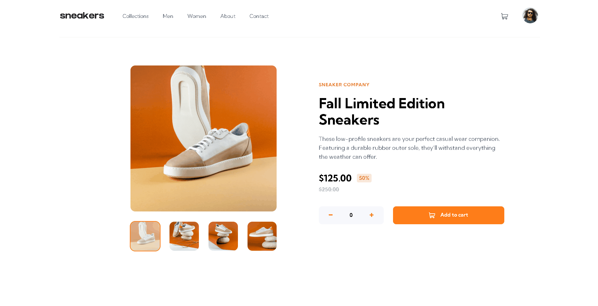
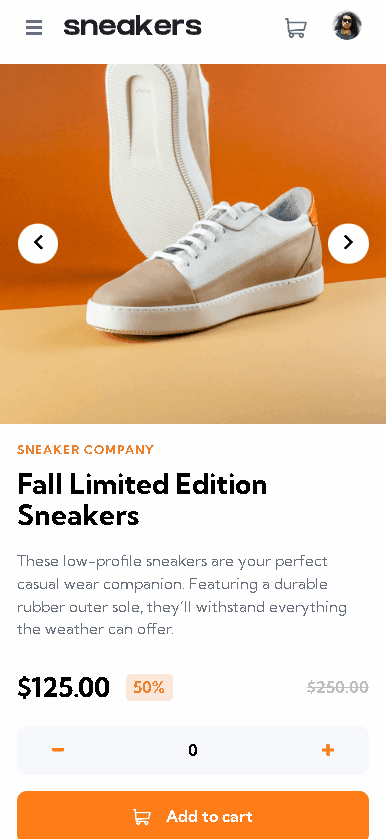

# Página de produto de E-Commerce

## Visão Geral

Essa é uma página web de uma loja com um produto sendo vendido.

### Resultado

[Clique aqui para acessar a página da aplicação](https://guilherme-dangelo.github.io/product-page-sneaker/)

### Design Responsivo

A aplicação também foi feita para ser funcionar e ser responsiva em diversas resoluções, incluindo celulares

[Clique aqui para acessar a página da aplicação](https://guilherme-dangelo.github.io/product-page-sneaker/)

## Meu processo

### Feito com:

- JavaScript
- HTML
- CSS

## Funcionalidades do Projeto

* Pode adicionar e/ou remover o produto do carrinho.
* O carrinho calcula o preço final do produto, independente de quantos estejam no carrinho.

### O que eu aprendi

Fazendo este projeto, eu melhorei a minha noção de estilização com o CSS, com isso fazendo a página ser extremamente limpa, responsiva e bonita.

 

## Autor

- Github - [Guilherme D'Angelo](https://github.com/Guilherme-DAngelo)
- Linkedin - [Guilherme D'Angelo](https://www.linkedin.co
